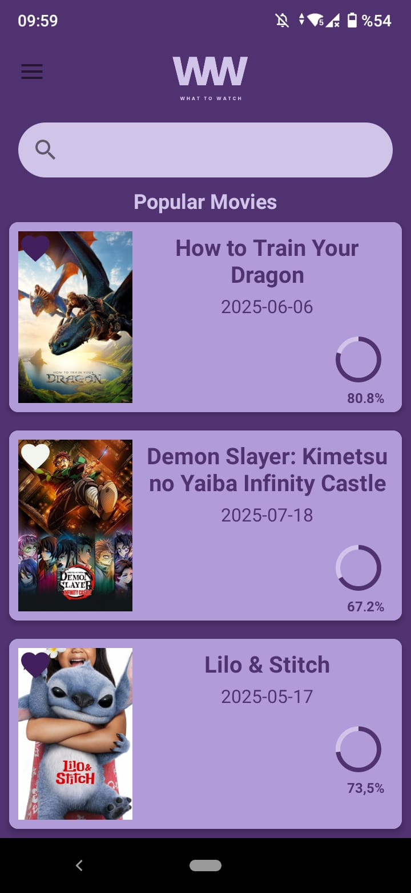
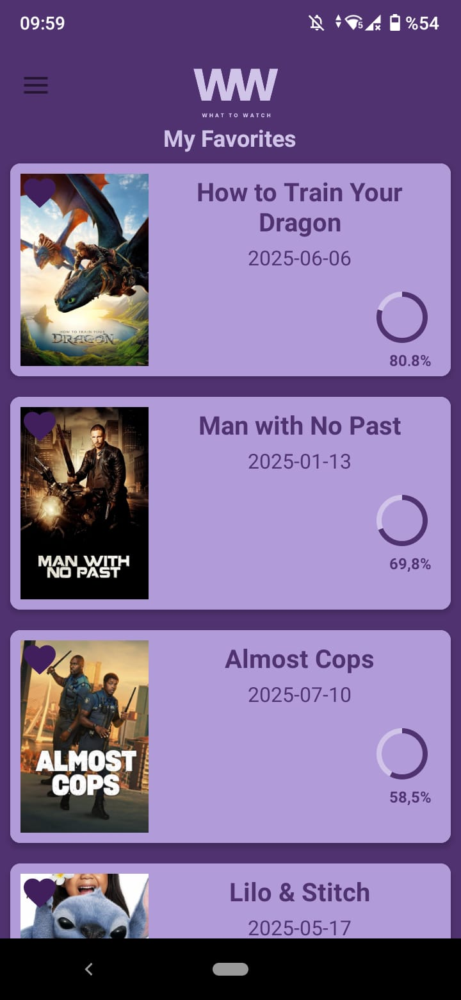
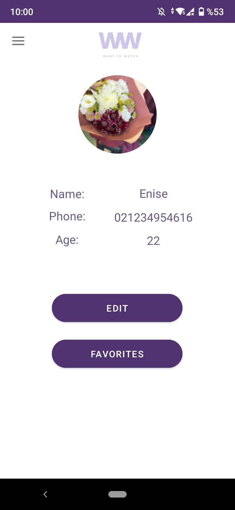

# Movie App - Android Uygulaması

Kotlin diliyle geliştirilen bu Android uygulaması, kullanıcıların popüler filmleri keşfetmesine, detaylarını incelemesine ve favorilerine eklemesine olanak tanır. TMDB (The Movie Database) API'si kullanılarak dinamik veri çekimi gerçekleştirilmiştir.

## Özellikler
- Popüler filmleri listeleme
- Arama yaparak film keşfetme
- Favorilere film ekleme
- Veri yenileme (Swipe to Refresh)
- TMDB API ile canlı veri kullanımı

## Kullanılan Teknolojiler

| Teknoloji        | Açıklama                          |
|------------------|-----------------------------------|
| Kotlin           | Modern Android uygulama dili      |
| Android Jetpack  | RecyclerView, ViewModel, Drawer   |
| Retrofit         | REST API tüketimi için            |
| Glide            | Film görselleri için görsel yükleyici |
| Firebase Auth    | Google ve e-mail ile giriş sistemi |
| Firestore Database | 	Kullanıcı bilgileri (favoriler vb.) gibi dinamik verileri saklamak için |
| XML              | Android UI bileşenlerini tanımlamak için kullanılan biçim |
| Cloudinary       | 	Kullanıcı profil fotoğraflarını yüklemek ve barındırmak için bulut tabanlı medya yönetim servisi|

## Ekran Görüntüleri
| Ana Sayfa | Favoriler | Profil |
|-----------|------------|-----------|
|  |  |  |

