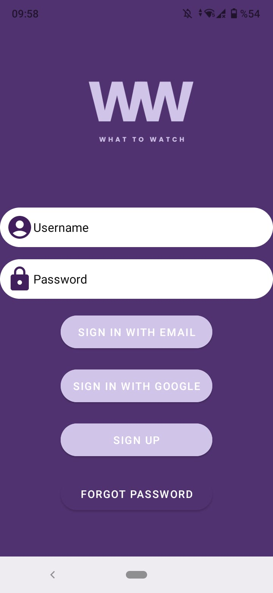
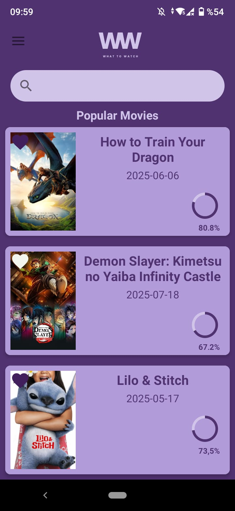
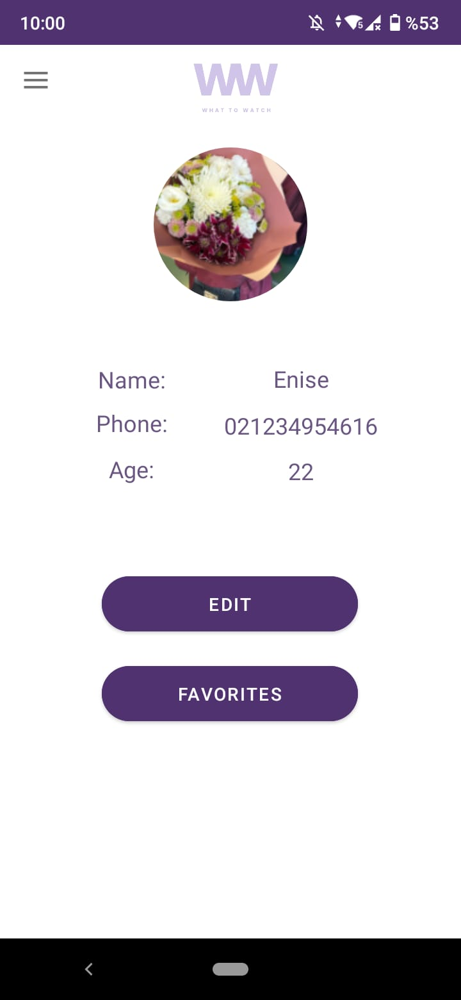
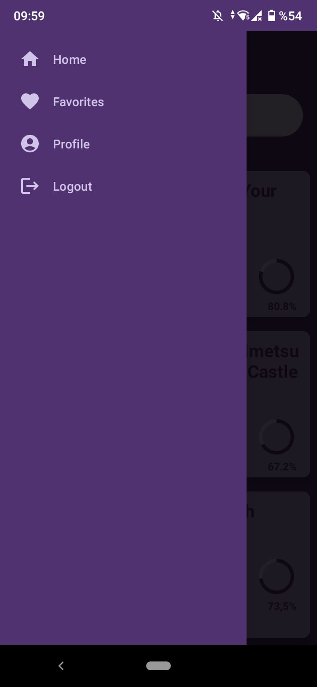
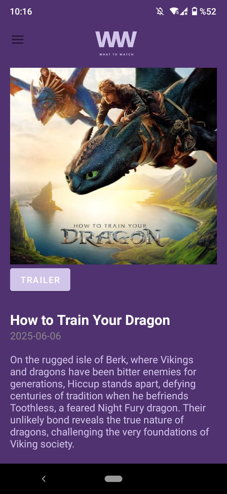
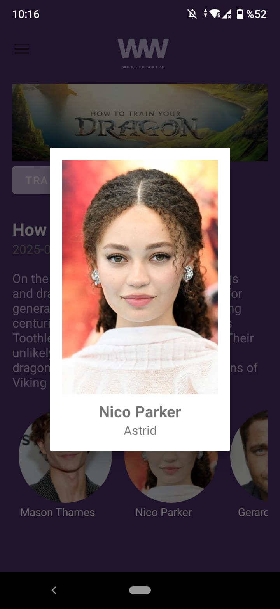
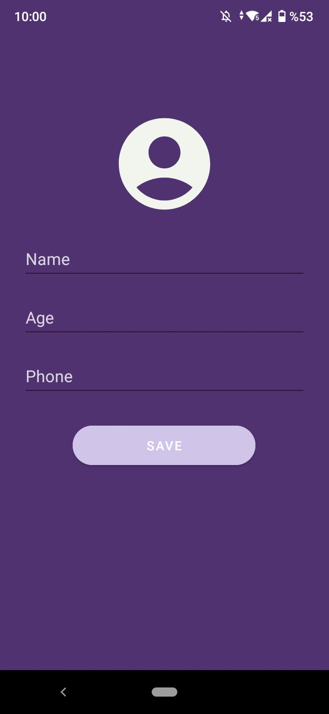
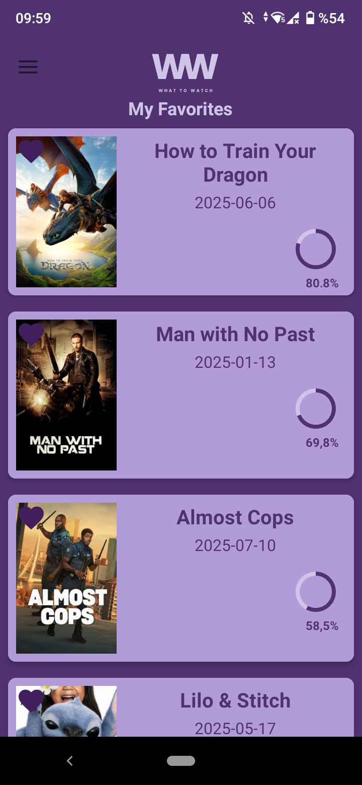

<p align="center">
  
</p>

# Movie App - Android Application

**Movie App** is an Android application developed in **Kotlin** that allows users to explore popular movies, view detailed information, and manage their favorite films. The app fetches live movie data using the **TMDB (The Movie Database) API**.  

## Features
- Browse popular movies
- Search for movies
- Add movies to favorites
- Pull-to-refresh functionality for updated content
- Real-time movie data via TMDB API

## Technologies Used

| Technology         | Purpose |
|-------------------|---------|
| Kotlin             | Android app development |
| Android Jetpack    | RecyclerView, Drawer components |
| Retrofit           | REST API integration |
| Glide              | Load and display movie images |
| Firebase Auth      | Google and email sign-in |
| Firestore Database | Store dynamic user data (favorites, profiles, etc.) |
| XML                | Android UI layout definition |
| Cloudinary         | Host and manage user profile images |

## Screenshots

### Main Screens

| Login Screen | Home Screen | Profile Page | Navigation Bar |
|--------------|-------------|--------------|----------------|
|  |  |  |  |

### Movie Detail Screens

| Movie Detail | Cast List | Edit Profile | Favorite Movies |
|--------------|-----------|--------------|----------------|
|  |  |  |  |

## Installation

1. Clone this repository:

```bash
git clone https://github.com/eniseahsen/movie-app-android
```

2. Navigate to the project directory:
   
```bash
cd movie-app-android
```

3. Open the project in Android Studio:
Open Android Studio → Click Open → Select the movie-app-android folder

4. Add your TMDB API key to local.properties:
TMDB_API_KEY=your_api_key_here

5. Sync the project and run it:
 Click Sync Now in Android Studio, then run the app on an emulator or a real device.


